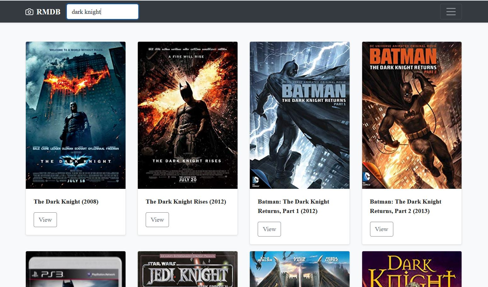
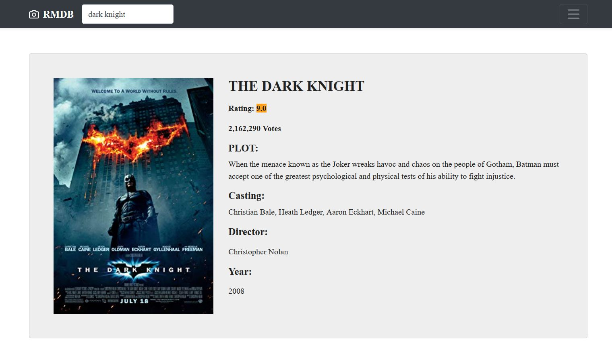

## React Movie Data Base
This is a react project of movies. User can search for movies in this site and see the details. For this project React, Bootstrap, SASS, GULP and REST API was used.

  

  

## Live Demo
https://test-a4801.firebaseapp.com

## Styles
This app was developed mobile first.

This project uses Bootstrap with Sass.

## Available Scripts

In the project directory, you can run:

### `npm start`

To run this app local, run "npm start".

You need to have nodejs in your computer.

### `gulp watch`

Watches any changes in the Sass files and compiles a new css file.

